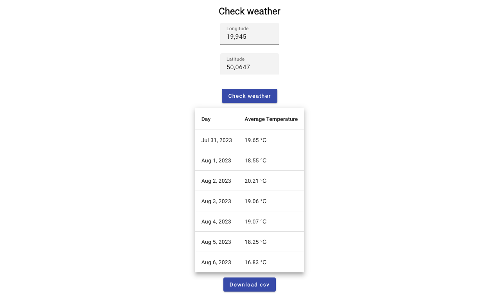

# Weather check
### Check weather based on coordinates

## Frontend

- Build with angular version 16

## Backend

- Build with .Net6
- Used [open metro api](https://open-meteo.com) for weather information

## Example for Cracow

